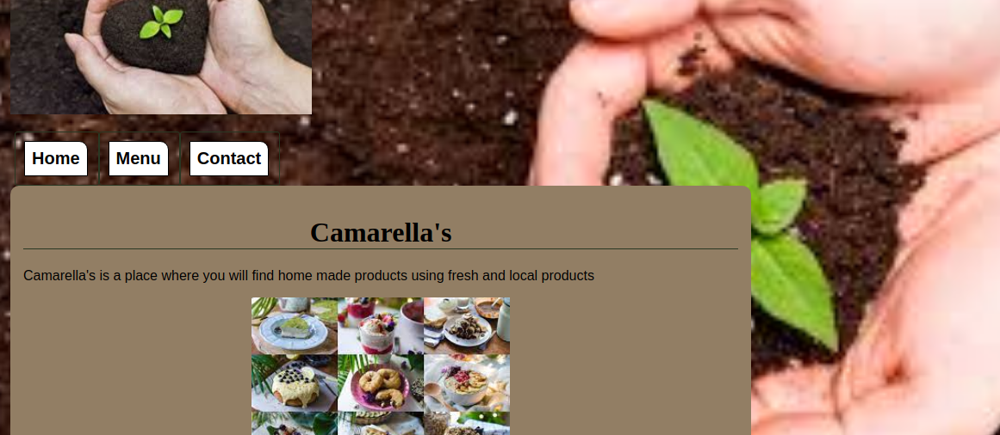

# restaurant-pg

> The goal of this project is to demonstrate mastery with DOM manipulation by dynamically rendering a simple restaurant's homepage. On this page, I used JavaScript alone to generate the entire contents of the website!

### You can access a Live Demo [HERE](https://rawcdn.githack.com/atenaiis/restaurant-pg/541bfdc2a8d5c6726b468c542fa35ddad677d6aa/dist/index.html)

## Built With

- Javascript
- Webpack
- HTML5
- CSS3

## Getting Started

- Open your terminal and cd where you want to store the project
- To clone the repository run the following command:

* git clone https://git@github.com:atenaiis/restaurant-pg.git 

- Change directory to point to the Restaurant-page dir.
-  Now run:
> `npm install`
- Finally run:

  npm start
- Go to the dist folder and select index.html, now Open the live server on your VScode Alt + L then Alt + o

## Authors

👤 **Atenais Campos**

- Github: [@atenaiis](https://github.com/atenaiis)
- Twitter: [@spranomarian](https://twitter.com/SopranoMarian)
- Linkedin: [linkedin](https://www.linkedin.com/in/mariana-atenai-campos-garcia-a30791143/)

## 🤝 Contributing

Contributions, issues and feature requests are welcome!

Feel free to check the isuue.

## Show your support

Give a ⭐️ if you like this project!

## 📝 License

MIT
